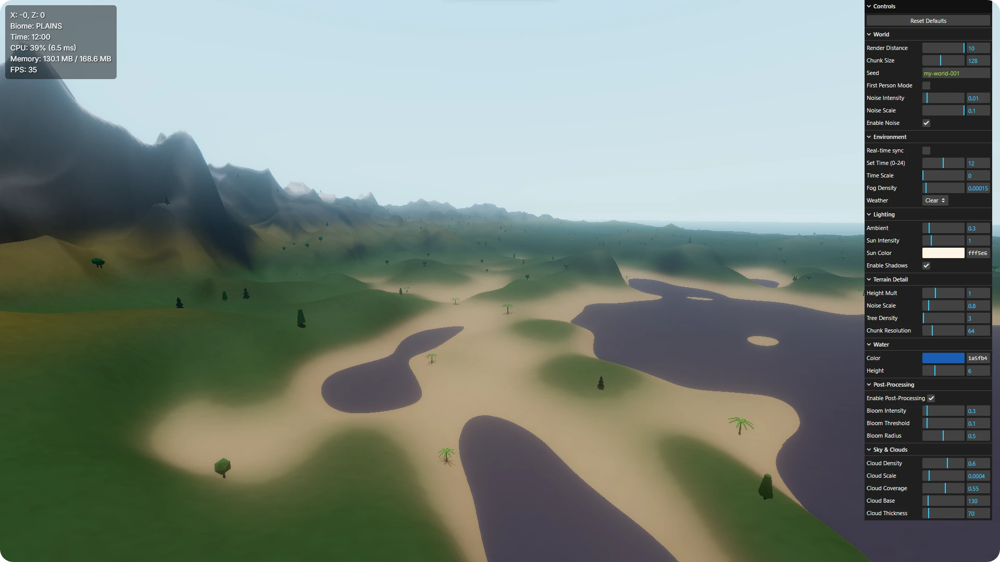

<p align="center">
  
</p>

# Three.js Procedural Terrain

[](https://developer.mozilla.org/en-US/docs/Web/HTML) [](https://developer.mozilla.org/en-US/docs/Web/JavaScript) [](https://www.npmjs.com/package/simplex-noise) [](https://threejs.org/) [](https://vitejs.dev/)

Three.js Procedural Terrain is a lightweight, client-side project for generating and exploring procedurally generated landscapes directly in the browser. It provides a chunked terrain pipeline, biome-driven surface rules, modular environment systems (sky, time, weather, water), and a simple vegetation/life system. Useful for demos, experiments, and small games.



## 🚀 Key Features

- **Chunked Streaming World**: Create and unload terrain chunks on demand for efficient memory and CPU usage.
- **Layered Noise Heightmaps**: Configurable noise layers produce varied mountains, plains, and valleys.
- **Biome Mapping**: Register biomes and generate biome-aware surface properties and colors.
- **Terrain Mesh Builder**: Generates per-chunk vertex data suitable for canvas/WebGL rendering.
- **Modular Environment Systems**: Time-of-day, sky rendering, weather, and water systems decoupled from core logic.
- **Vegetation System**: Procedural placement and simple updates for foliage and props.
- **Player & Camera**: First-person style movement and camera controls for exploration.

## 🛠️ Tech Stack

- Vanilla JavaScript (ES Modules).
- Vite for development and bundling.
- Canvas / WebGL rendering via lightweight engine code.
- Simple deterministic randomness via a seeded RNG.

## 📦 Getting Started

Follow these steps to get a local copy up and running.

### Prerequisites

* **Node.js**: Version 18.0.0 or higher
* **npm**: Usually comes with Node.js

### Installation & Setup

1. **Clone the repository**
   ```bash
   git clone https://github.com/dimartarmizi/threejs-procedural-terrain.git
   cd threejs-procedural-terrain
   ```

2. **Install dependencies**
   ```bash
   npm install
   ```

3. **Start development server**
   ```bash
   npm run dev
   ```
   The app will be available at `http://localhost:5173`.

4. **Build for production**
   ```bash
   npm run build
   ```
   Optimized files will be generated in the `dist/` folder.

## 📜 Technical Overview

1. `src/core/Engine.js` — application bootstrap, system orchestration, and main loop.
2. `src/terrain/Noise.js` & `src/terrain/HeightGenerator.js` — multi-layer noise and heightmap generation.
3. `src/terrain/TerrainMeshBuilder.js` — converts height data into renderable mesh data per chunk.
4. `src/biomes/BiomeRegistry.js` & `src/terrain/BiomeMap.js` — registers and maps biome rules to terrain.
5. `src/environment/*` — separate systems for sky, time, water, and weather effects.
6. `src/life/VegetationSystem.js` — procedural placement and simple runtime updates for vegetation.

## 📧 Contact

If you have any questions, suggestions, or just want to reach out, feel free to contact me at [dimartarmizi@gmail.com](mailto:dimartarmizi@gmail.com).

## ⚖️ License

This project is open-source and available under the [MIT License](LICENSE).